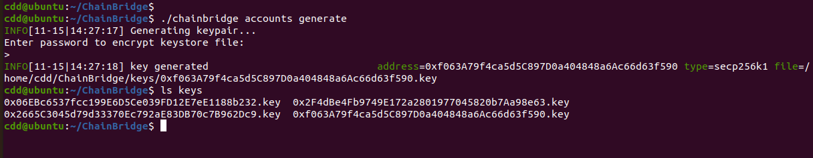
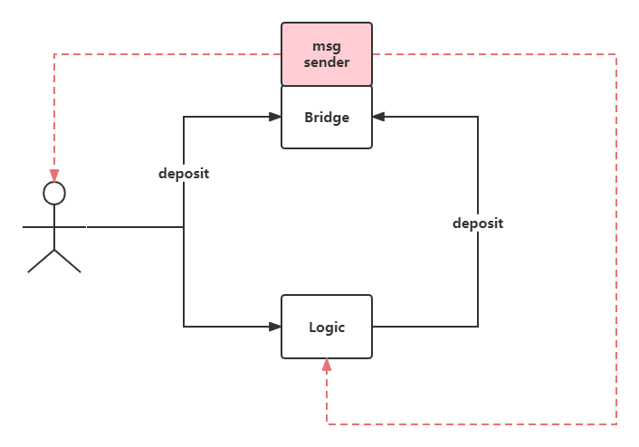

# ChainBridge实践

整个Chain Bridge由三部分组成:
* ChainA上的合约
* ChainB上的合约
* ChainBridge Server

## 其他
* [cb-sol-cli](https://github.com/ChainSafe/chainbridge-deploy)
* [ChainBridge Server](https://github.com/ChainSafe/ChainBridge.git)

## 视频教程
* **Bilibili**
  * [01-使用默认的ERC20合约](https://www.bilibili.com/video/BV1QG4y147pN/?spm_id_from=333.999.0.0) 
  * [02-自写ERC20合约包装原生币](https://www.bilibili.com/video/BV1Dv4y1m7WC/?spm_id_from=333.999.0.0)
* **YouTube**
  * [01-使用默认的ERC20合约](https://www.youtube.com/watch?v=n2VABdFXlu4&list=PL9aoThVN5PLlJ-jVR0seDFxy5h25cdgum&index=1)
  * [02-自写ERC20合约包装原生币](https://www.youtube.com/watch?v=JJGlEaVOWD4&list=PL9aoThVN5PLlJ-jVR0seDFxy5h25cdgum&index=2)

## 部署
### 0.部署ERC20合约
两条链上分别部署`contracts/WGSC.sol`和`contracts/WFRA.sol`。并调用对应的mint方法，把原生币转换成合约币。
以下步骤在两条链是完全一样的，只是参数有所不同。

### 1.部署合约
relayer地址需要用ChainBridge命令行生成。
```
cb-sol-cli deploy \
--url {RPC地址} \
--privateKey {私钥} \
--bridge \
--erc20Handler \
--relayers="{relayer1地址},{relayer2地址}, ..." \
--relayerThreshold {relayer数量} \
--chainId {chain_id}
```

### 2.注册合约
```
cb-sol-cli bridge register-resource \
--url {RPC地址} \
--privateKey {私钥} \
--bridge {桥地址} \
--handler {Erc20Handler地址} \
--targetContract {ERC20地址} \
--resourceId 0x000000000000000000000000000000e389d61c11e5fe32ec1735b3cd38c69500
```

### 3.设置ERC20Handler可以销毁ERC20
```
cb-sol-cli bridge \
set-burn \
--url {RPC地址}  \
--privateKey {私钥} \
--bridge {桥地址} \
--handler {Erc20Handler地址} \
--tokenContract {ERC20地址}
```

### 4.设置ERC20Handler可以铸造ERC20
```
cb-sol-cli erc20 \
add-minter \
--url {RPC地址}  \
--privateKey {私钥} \
--erc20Address {ERC20地址} \
--minter {minter地址}
```

### 5.给ERC20Handler授权
```
cb-sol-cli erc20 \
approve \
--url {RPC地址} \
--privateKey {私钥} \
--erc20Address {ERC20地址} \
--amount {数量} \
--recipient {ERC20Handler地址} 
```

### 6.调用bridge的deposit方法跨链
```
cb-sol-cli erc20 \
deposit \
--url {RPC地址}  \
--privateKey {私钥} \
--bridge {桥地址} \
--recipient {目标链上的接收地址} \
--amount {数量} \
--dest {目标链ID} \
--resourceId 0x000000000000000000000000000000e389d61c11e5fe32ec1735b3cd38c69500
```

### 注意事项
**要保证relayer有足够的币，以便其发起交易。**

## 启动ChainBridge服务
### 编译
```
make build
```
### 生成地址
```
chainbrige accounts generate
```
可指定目录，不指定的话，就会在当前目录下创建keys目录，生成到keys里面。文件名是地址以`.key`结尾。

### 配置
创建一个JSON格式的配置文件，写入如下配置。
常用配置
* `type`: "substrate"或"ethereum"
* `id`: 使用cb-sol-cli部署时，填的chain_id
* `endpoint`: RPC地址
* `from`: 该链上的relayer地址
* `bridge`: 桥地址
* `erc20handler`: erc20Handler地址
* `http`: 开启http
```json
{
  "Chains": [
    {
      "name": "gsc",
      "type": "ethereum",
      "id": "0",
      "endpoint": "http://192.168.6.137:8545",
      "from": "0x2F4dBe4Fb9749E172a2801977045820b7Aa98e63",
      "opts": {
        "bridge": "0x81307E37Ff4EBB34fadc9D23Ea8c5F754c2DaB0b",
        "erc20Handler": "0x4000F19Cd63F7450C5134DfC77E9ac3B811F08f6",
        "gasLimit": "8000000",
        "maxGasPrice": "10000000000",
        "startBlock": "0",
        "http": "true"
      }
    },
    {
      "name": "fra",
      "type": "ethereum",
      "id": "1",
      "endpoint": "http://127.0.0.1:8545",
      "from": "0x06EBc6537fcc199E6D5Ce039FD12E7eE1188b232",
      "opts": {
        "bridge": "0x8Ff52A56A037bFB187A45324b46DeF9F8A001b7F",
        "erc20Handler": "0xC04266765313361Aae48dCC2f1F1c4d4584Bd42b",
        "gasLimit": "8000000",
        "maxGasPrice": "10000000000",
        "startBlock": "0",
        "http": "true"
      }
    }
  ]
}
```
### 启动
```
chainbridge --config config.json --keystore keys --blockstore data
```
* `--config`: 指定配置文件。
* `--keys`: 指定私钥文件目录。
* `--blockstore`:指定block存储目录，存放已经扫描过的区块的高度。

## 通过其他合约跨链



用户直接调用桥合约和通过其他合约调用桥合约，桥合约的`deposit`方法的`msg.sender`不一样了。

### 0.部署ERC20合约
两条链上分别部署`contracts/WGSC.sol`和`contracts/WFRA.sol`。

### 1.部署合约
```
cb-sol-cli deploy \
--url {RPC地址} \
--privateKey {私钥} \
--bridge \
--erc20Handler \
--relayers="{relayer1地址},{relayer2地址}, ..." \
--relayerThreshold {relayer数量} \
--chainId {chain_id}
```

### 2.注册合约
```
cb-sol-cli bridge register-resource \
--url {RPC地址} \
--privateKey {私钥} \
--bridge {桥地址} \
--handler {Erc20Handler地址} \
--targetContract {ERC20地址} \
--resourceId 0x000000000000000000000000000000e389d61c11e5fe32ec1735b3cd38c69500
```

### 3.设置ERC20Handler可以销毁ERC20
```
cb-sol-cli bridge \
set-burn \
--url {RPC地址}  \
--privateKey {私钥} \
--bridge {桥地址} \
--handler {Erc20Handler地址} \
--tokenContract {ERC20地址}
```

### 4.设置ERC20Handler可以铸造ERC20
```
cb-sol-cli erc20 \
add-minter \
--url {RPC地址}  \
--privateKey {私钥} \
--erc20Address {ERC20地址} \
--minter {minter地址}
```

### 5.给ERC20Handler和Logic合约授权
### 6.调用logic合约的deposit方法跨链
